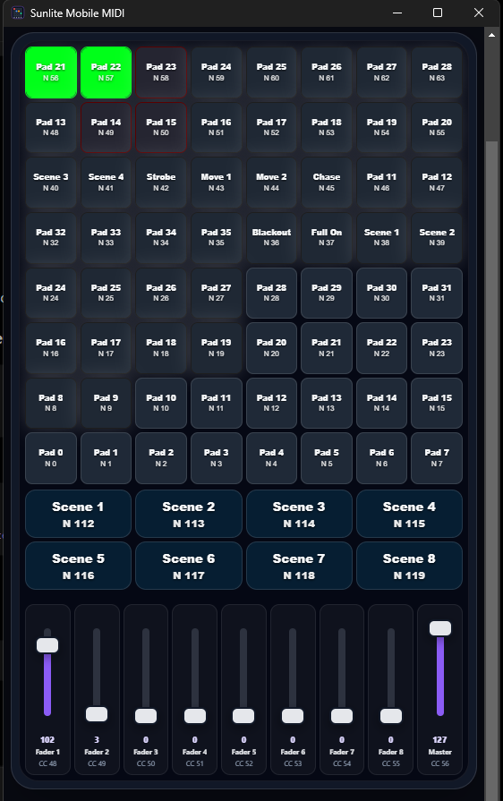

# Sunlite Mobile MIDI

Electron + React mobile MIDI controller for Sunlite Suite 2 and FreeStyler. It lets a phone or tablet control lighting software through a local Wi-Fi web interface and loopMIDI.



## How it works

```txt
Phone / tablet
  -> Wi-Fi web controller
  -> Electron app on PC
  -> loopMIDI
  -> Sunlite / FreeStyler
```

For feedback colors and fader values:

```txt
Sunlite / FreeStyler MIDI OUT
  -> loopMIDI
  -> Electron app
  -> WebSocket
  -> Phone / tablet UI
```

## Windows setup

1. Install loopMIDI.
2. Create two loopMIDI ports:

```txt
Sunlite Mobile In
Sunlite Mobile Out
```

3. In Sunlite or FreeStyler, select:

```txt
MIDI input  -> Sunlite Mobile In
MIDI output -> Sunlite Mobile Out
```

4. Start the app.
5. Scan the QR code from your phone.
6. Map the MIDI notes and CC controls in the lighting software.

## MIDI routing

Use separate ports:

```txt
App -> Sunlite Mobile In -> Lighting software
Lighting software -> Sunlite Mobile Out -> App feedback
```

Do not use the same port for both input and output.

## Controller layout

The app renders the active MIDI console from a controller model definition in:

```txt
src/shared/midi-controllers/
```

The current default model is `akai-apc-mini-mk2`. Additional console models should be
created as their own files, then added to `CONTROLLER_MODELS` in
`src/shared/controller-models.ts`.

- 8×8 pad matrix.
- Pads start at MIDI note `36`.
- Right-hand scene buttons use MIDI notes `112` through `119`.
- Bottom pads use MIDI notes `100` through `107`.
- Bottom-right corner pad uses MIDI note `122`.
- Faders use CC `1` through `9`.

## Default mapping

```txt
Pad 1 / Blackout  -> Note 36
Pad 2 / Full On   -> Note 37
Pad 3 / Scene 1   -> Note 38
Pad 4 / Scene 2   -> Note 39
Pad 5 / Scene 3   -> Note 40
Pad 6 / Scene 4   -> Note 41
Pad 7 / Strobe    -> Note 42
Pad 8 / Move 1    -> Note 43

Scene Launch 1    -> Note 112
Scene Launch 2    -> Note 113
...
Scene Launch 8    -> Note 119

Bottom 1          -> Note 100
Bottom 2          -> Note 101
...
Bottom 8          -> Note 107

Corner            -> Note 122

Dimmer            -> CC 1
Speed             -> CC 2
Red               -> CC 3
Green             -> CC 4
Blue              -> CC 5
White             -> CC 6
FX                -> CC 7
Size              -> CC 8
Master            -> CC 9
```

## MIDI feedback colors

Incoming MIDI note velocity controls the pad color using the APC RGB velocity table.

Examples:

```txt
Velocity 0   -> off
Velocity 9   -> orange
Velocity 21  -> green
Velocity 45  -> blue
Velocity 96  -> orange
Velocity 127 -> dark brown
```

The MIDI channel controls LED behavior or brightness. The velocity controls the color.

## Development

```bash
bun install
bun run start
```

## Format and check

```bash
bun run format
bun run check
```

## Build

```bash
bun run dist:win
```

Build files are generated in:

```txt
release/
```

## Change MIDI port names

PowerShell:

```powershell
$env:MIDI_OUTPUT_NAME="My MIDI Input Port"
$env:MIDI_INPUT_NAME="My MIDI Feedback Port"
bun run start
```

CMD:

```cmd
set MIDI_OUTPUT_NAME=My MIDI Input Port
set MIDI_INPUT_NAME=My MIDI Feedback Port
bun run start
```

## Change HTTP port

The default port is `3000`. If it is busy, the app tries the next available port.

To set a preferred port:

```powershell
$env:PORT="3005"
bun run start
```

## Firewall

The phone must be on the same Wi-Fi network as the PC. Windows Firewall must allow the app, Node, or Electron to accept private network connections.

## Updates

For update hosting details, see:

```txt
UPDATE_SETUP.md
```
