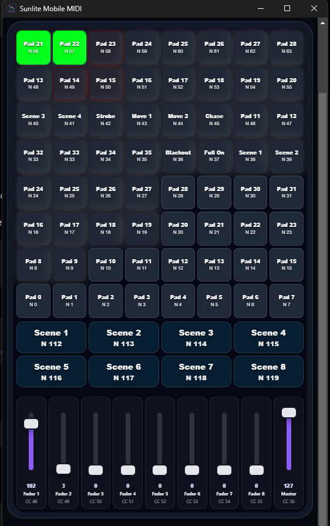

# Sunlite Mobile MIDI

Electron + React mobile MIDI controller for Sunlite Suite 2 and FreeStyler. It lets a phone or tablet control lighting software through a local Wi-Fi web interface and a locally managed virtual MIDI bridge.

Version 0.3 also includes Automation Studio: local audio analysis, CDJ-3000 beat/position monitoring through PRO DJ LINK, recording of MIDI training sessions, and assisted or automatic scene triggering.



## How it works

```txt
Phone / tablet
  -> Wi-Fi web controller
  -> Electron app on PC
  -> Automatically managed virtual MIDI bridge
  -> Sunlite / FreeStyler
```

For feedback colors and fader values:

```txt
Sunlite / FreeStyler MIDI OUT
  -> Virtual MIDI bridge
  -> Electron app
  -> WebSocket
  -> Phone / tablet UI
```

## Plug-and-play Windows setup

1. Install Sunlite Mobile MIDI.
2. Open the application. On a new PC, accept the Windows elevation prompt for the MIDI driver.
3. The application silently creates and starts these ports:

```txt
Sunlite Mobile In
Sunlite Mobile Out
```

4. In Sunlite or FreeStyler, select:

```txt
MIDI input  -> Sunlite Mobile In
MIDI output -> Sunlite Mobile Out
```

5. Map the MIDI notes and CC controls to the scenes in that show, then scan the QR code from your phone.

The virtual bridge installation, port creation, minimized startup and reconnection are automatic. Mapping scenes cannot be inferred globally because every Sunlite show has different pages and buttons; it is a one-time operation per show.

### MIDI driver distribution

Private development builds currently use loopMIDI as the Windows MIDI 1.0 bridge. The loopMIDI author's published terms prohibit redistribution without prior written consent. A public or commercial installer must therefore use the licensed virtualMIDI redistributable MSI, supplied under a license from its author, or a separately developed and Microsoft-signed MIDI driver. The provisioning code is isolated so that either driver package can be inserted without changing the controller or automation engine.

## MIDI routing

Use separate ports:

```txt
App -> Sunlite Mobile In -> Lighting software
Lighting software -> Sunlite Mobile Out -> App feedback
```

Do not use the same port for both input and output.

## Controller layout

The app renders the active MIDI console from a controller model definition in:

```txt
src/shared/midi-controllers/
```

The current default model is `akai-apc-mini-mk2`. Additional console models should be
created as their own files, then added to `CONTROLLER_MODELS` in
`src/shared/controller-models.ts`.

- 8×8 pad matrix.
- Pads start at MIDI note `36`.
- Right-hand scene buttons use MIDI notes `112` through `119`.
- Bottom pads use MIDI notes `100` through `107`.
- Bottom-right corner pad uses MIDI note `122`.
- Faders use CC `1` through `9`.

## Default mapping

```txt
Pad 1 / Blackout  -> Note 36
Pad 2 / Full On   -> Note 37
Pad 3 / Scene 1   -> Note 38
Pad 4 / Scene 2   -> Note 39
Pad 5 / Scene 3   -> Note 40
Pad 6 / Scene 4   -> Note 41
Pad 7 / Strobe    -> Note 42
Pad 8 / Move 1    -> Note 43

Scene Launch 1    -> Note 112
Scene Launch 2    -> Note 113
...
Scene Launch 8    -> Note 119

Bottom 1          -> Note 100
Bottom 2          -> Note 101
...
Bottom 8          -> Note 107

Corner            -> Note 122

Dimmer            -> CC 1
Speed             -> CC 2
Red               -> CC 3
Green             -> CC 4
Blue              -> CC 5
White             -> CC 6
FX                -> CC 7
Size              -> CC 8
Master            -> CC 9
```

## MIDI feedback colors

Incoming MIDI note velocity controls the pad color using the APC RGB velocity table.

Examples:

```txt
Velocity 0   -> off
Velocity 9   -> orange
Velocity 21  -> green
Velocity 45  -> blue
Velocity 96  -> orange
Velocity 127 -> dark brown
```

The MIDI channel controls LED behavior or brightness. The velocity controls the color.

## Automation Studio

Automation Studio runs locally and does not upload audio or training data. It combines:

- Audio captured from a DJ mixer USB input or REC OUT connected to an audio interface.
- A passive Python-based PRO DJ LINK listener for CDJ device, beat, bar and CDJ-3000 precise-position packets.
- MIDI actions already sent by this application to Sunlite.
- A lightweight example-based model with confidence and safety limits.

The installed application does **not** require Python or a JDK. The Python listener is compiled into `prodj-link-bridge.exe` and bundled as an Electron extra resource.

### CDJ and mixer connection

1. Connect the CDJ-3000 players, compatible DJ mixer, and the Windows computer to the same wired Ethernet switch.
2. Use rekordbox-analyzed tracks so the players transmit accurate beat-grid information.
3. Connect the mixer audio to the computer using its USB audio driver or REC OUT through an audio interface.
4. Open Automation Studio and select that audio input.
5. Keep the application in **Manual** mode and record a training session while operating Sunlite normally.
6. Stop the recording to train the local model, then test **Assisted** mode before enabling **Auto**.

The PRO DJ LINK component is passive: it listens on UDP ports `50000` and `50001` and never announces itself as a virtual player or sends commands to the CDJs. Only one application can normally own these listening ports, so rekordbox or another PRO DJ LINK integration may conflict on the same computer.

### Automation safety

- Notes `36` and `37` are protected by default because the default mapping uses them for Blackout and Full On.
- Note `42` is treated as strobe and receives an additional cooldown.
- Manual MIDI input suspends automatic output temporarily.
- PRO DJ LINK decisions are quantized to the first beat of a bar.
- Automatic output requires a trained model, live audio, and the configured confidence threshold.
- Sessions and the model are stored under the Electron user-data directory in `automation/`.

### Training data review

Select a saved session to display its spectrogram, beats and MIDI actions. Incorrect actions can be excluded from the model, and the model is immediately rebuilt without those examples.

## Development

```bash
bun install
bun run start
```

## Format and check

```bash
bun run format
bun run check
```

## Build

```bash
bun run dist:win
```

`dist:win` first runs PyInstaller to produce the standalone PRO DJ LINK sidecar. Python and PyInstaller are build-time dependencies only:

```powershell
python -m pip install -r python/requirements-build.txt
bun run build:sidecar
```

Build files are generated in:

```txt
release/
```

## Change MIDI port names

PowerShell:

```powershell
$env:MIDI_OUTPUT_NAME="My MIDI Input Port"
$env:MIDI_INPUT_NAME="My MIDI Feedback Port"
bun run start
```

CMD:

```cmd
set MIDI_OUTPUT_NAME=My MIDI Input Port
set MIDI_INPUT_NAME=My MIDI Feedback Port
bun run start
```

## Change HTTP port

The default port is `3000`. If it is busy, the app tries the next available port.

To set a preferred port:

```powershell
$env:PORT="3005"
bun run start
```

## Firewall

The phone must be on the same Wi-Fi network as the PC. Windows Firewall must allow the app, Node, or Electron to accept private network connections.

## Updates

For update hosting details, see:

```txt
UPDATE_SETUP.md
```
